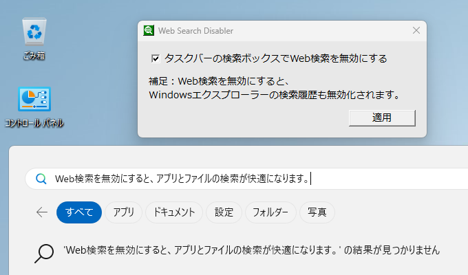
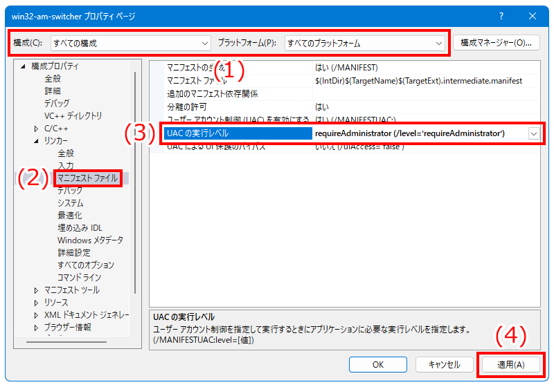

# Web Search Disabler

Web Search Disablerは、Windowsのタスクバーに実装されているWeb検索を無効にして、検索作業を快適にする簡易的なソフトです。

Web Search Disabler is a simple software, that disables the web search implemented on the Windows taskbar, to make searching tasks more convenient.

Windows 10でタスクバーに検索ボックスが追加され、アプリやファイルの検索だけでなく、Bingを用いたWeb検索ができるようになりました。しかしアプリやファイルを検索しようとしているのに、タイプミスがあると自動的にWeb検索に切り替わってしまい、その状態でEnterキーを押すと既定のWebブラウザーが起動してしまいます。このソフトでWeb検索を無効にしておくことで、Webブラウザーの起動を未然に防ぎます。

The search box has been added to the taskbar in Windows 10, and you can not only search for apps and files, but also search the web with Bing. However, if you are trying to search for apps or files and there is a typo, it will automatically switch to web search, and if you press Enter in that state, the default web browser will launch. By disabling web search with this software, no more distractions from launching the web browser.

# 使い方（How to use）

本リポジトリのリリースページからインストーラーをダウンロードして実行します。ソフトのインストールおよび実行には管理者権限が必要です。

Download the installer from the releases page of this repository and run it. Administrative privileges are required to install and run the software.

- <https://github.com/sakasagiken/win32-web-search-disabler/releases>

Web検索の無効化は、PCに追加されている全てのユーザーに適用されます。また、変更を適用する際は再度サインインする必要があります。

Disabling web search applies to all users added on the PC. And, you will need to sign back in to apply the changes.

# 処理内容（How it works）

以下のレジストリキーに指定したレジストリ値を書き込むことで、Web検索を無効化しています。逆に有効化する場合は、このレジストリ値は削除されます。

Disable web search by writing the specified registry value to the following registry key. Enable web search by delete this registry key.

- レジストリキー（Registry key）
    - `HKEY_LOCAL_MACHINE\SOFTWARE\Policies\Microsoft\Windows\Explorer`
- レジストリ値（Registry value）
    - 名前（Name）：`DisableSearchBoxSuggestions`
    - 種類（Type）：`REG_DWORD`
    - データ（Data）：`1`

詳細は `wWinMain.cpp` をご覧ください。このソフトのすべての処理が、このソースコードに書かれています。レジストリのルートキーが `HKEY_LOCAL_MACHINE` であるため、レジストリを変更するには管理者権限が必須です。

See `wWinMain.cpp` for details. All processing of this software is written in this source code. Since the root key of the registry is `HKEY_LOCAL_MACHINE`, admin rights are mandatory to modify the registry.

# ビルド方法（How to build）

`win32-web-search-disabler.sln` を開くとVisual Studioが起動して、そのままビルドできます。

Just open `win32-web-search-disabler.sln`, Visual Studio will start and it can be built as is.

手動でビルドする際は、`wWinMain.cpp`、`web-search-disabler.rc`、`web-search-disabler.ico` をプロジェクトに取り込んでください。ただし、このままだと手動で管理者として実行しない限り、有効・無効の切り替えができないため、プロジェクトのプロパティからマニフェストファイルを編集します。以下の画像の通りに設定することで、管理者権限が必須の実行ファイルが作成されます。

When building manually, include `wWinMain.cpp`, `web-search-disabler.rc` and `web-search-disabler.ico` into project. However, in this state, unless you manually run it as an administrator, you can not switch between enabled and disabled, so edit the manifest file from the project properties. By setting as shown in the image below, an executable file that requires administrator privileges will be created.

# 注意事項（Notes）

このプログラムはソースコードが公開されているフリーソフトウェアです。個人情報や金銭の窃取、ならびに悪戯を目的としたプログラムではありませんが、使用中もしくは使用後に何らかの障害や損害が発生しても一切の責任を負いません。

This program is open source software. It is not a program intended for stealing personal information or money, or for mischief, but I do not take any responsibility even if some kind of failure or damage occurs during or after use.
